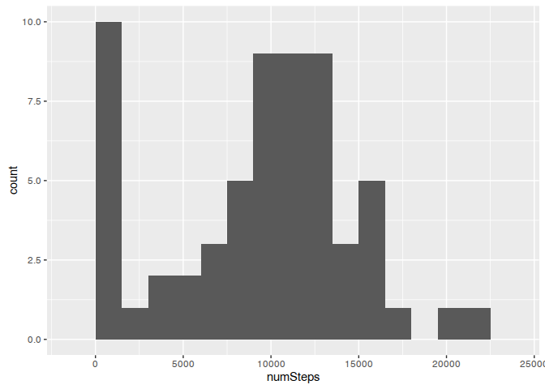
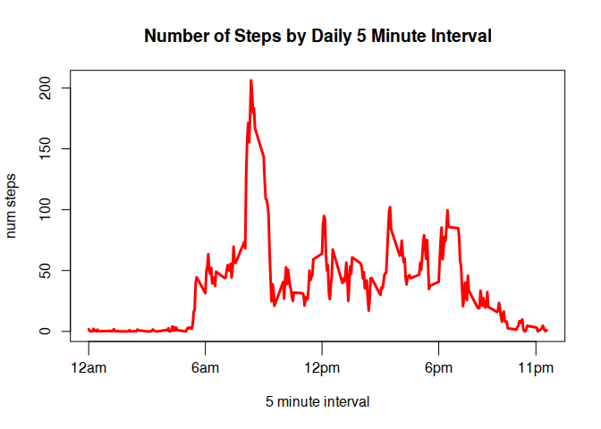
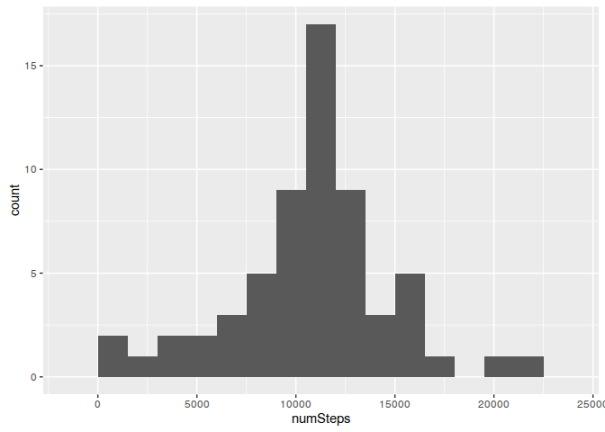
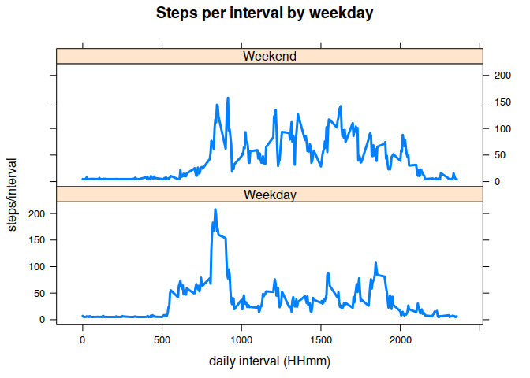

# Reproducible Research: Peer Assessment 1
Joe Zendle  
Jan, 5 2016  


## Loading and preprocessing the data


```r
library(dplyr, quietly = TRUE,warn.conflicts = FALSE)
unzip(zipfile = "activity.zip",overwrite = TRUE)
csv <- read.csv("activity.csv")

# add date object column
csv <- mutate(csv, dateDate = as.Date(date))

str(csv)
```

```
## 'data.frame':	17568 obs. of  4 variables:
##  $ steps   : int  NA NA NA NA NA NA NA NA NA NA ...
##  $ date    : Factor w/ 61 levels "2012-10-01","2012-10-02",..: 1 1 1 1 1 1 1 1 1 1 ...
##  $ interval: int  0 5 10 15 20 25 30 35 40 45 ...
##  $ dateDate: Date, format: "2012-10-01" "2012-10-01" ...
```

```r
summary(csv)
```

```
##      steps                date          interval         dateDate         
##  Min.   :  0.00   2012-10-01:  288   Min.   :   0.0   Min.   :2012-10-01  
##  1st Qu.:  0.00   2012-10-02:  288   1st Qu.: 588.8   1st Qu.:2012-10-16  
##  Median :  0.00   2012-10-03:  288   Median :1177.5   Median :2012-10-31  
##  Mean   : 37.38   2012-10-04:  288   Mean   :1177.5   Mean   :2012-10-31  
##  3rd Qu.: 12.00   2012-10-05:  288   3rd Qu.:1766.2   3rd Qu.:2012-11-15  
##  Max.   :806.00   2012-10-06:  288   Max.   :2355.0   Max.   :2012-11-30  
##  NA's   :2304     (Other)   :15840
```

```r
# how many NA's?
sum(is.na(csv$steps))
```

```
## [1] 2304
```

```r
# many

# how many zeros?
sum(csv$steps[csv$steps == 0], na.rm=T)
```

```
## [1] 0
```

```r
# none
```
## What is mean total number of steps taken per day?

From problem statement:

1) Calculate the total number of steps taken per day.


```r
byDate <- group_by(csv, dateDate)

stepsByDate <- summarise(byDate, numSteps = sum(steps, na.rm = TRUE))
```

2) Make a histogram of the total number of steps taken each day.


```r
library(ggplot2)
qplot(numSteps, data=stepsByDate, binw=1500)
```

 

3) Calculate and report the mean and median of the total number of steps taken per day.


```r
mean( stepsByDate$numSteps)
```

```
## [1] 9354.23
```

```r
sd(stepsByDate$numSteps) 
```

```
## [1] 5405.895
```

## What is the average daily activity pattern?

From problem statement:

1) Make a time series plot (i.e. type = "l") of the 5-minute interval (x-axis) and the average number of steps taken, averaged across all days (y-axis)

```r
byInterval <- group_by(csv, interval)

stepsByInterval <- summarise(byInterval, avgSteps = mean(steps, na.rm = TRUE))

# interval number are in  HHmm format so make them nicer on x-axis
v1 <- c(0,600,1200,1800,2300)
v2 <- c("12am","6am","12pm", "6pm","11pm")
# dev.off()
plot(x=stepsByInterval$interval,
     y=stepsByInterval$avgSteps,
     xlab="5 minute interval",
     ylab="num steps",
     main="Number of Steps by Daily 5 Minute Interval",
     lwd=3,
     col="red",
     type="l",
     xaxt="n") # build the x-axis ticks in next step
axis(side = 1, 
     at = v1, 
     labels = v2,
     tck=-.05)
```

 

2) Which 5-minute interval, on average across all the days in the dataset, contains the maximum number of steps?


```r
# find the value of interval corresponding with max value of average steps

filter( stepsByInterval, stepsByInterval$avgSteps == max(stepsByInterval$avgSteps))$int
```

```
## [1] 835
```

From this calculation, the interval with the largest number of steps is between 8:35-8:40am.

## Imputing missing values

From problem statement:

1) Calculate and report the total number of missing values in the dataset (i.e. the total number of rows with NAs)

```r
# how many NA's?
sum(is.na(csv$steps))
```

```
## [1] 2304
```

2) Devise a strategy for filling in all of the missing values in the dataset. The strategy does not need to be sophisticated. For example, you could use the mean/median for that day, or the mean for that 5-minute interval, etc.

I will use the mean of all intervals for the value of the NA's in the data:

```r
mnIntervals <- mean(csv$steps,na.rm=T)
mnIntervals
```

```
## [1] 37.3826
```

3) Create a new dataset that is equal to the original dataset but with the missing data filled in.


```r
newCsv <- csv # make copy

nas <- is.na(newCsv$steps) # find the NAs

newCsv$steps[nas] <- mnIntervals # substitute the new value

sum(is.na(newCsv$steps)) # sanity check - should be zero
```

```
## [1] 0
```

4) Make a histogram of the total number of steps taken each day and Calculate and report the mean and median total number of steps taken per day. Do these values differ from the estimates from the first part of the assignment? What is the impact of imputing missing data on the estimates of the total daily number of steps?


```r
newByDate <- group_by(newCsv, dateDate) # group by date

newStepsByDate <- summarise(newByDate, numSteps = sum(steps))

qplot(numSteps, data=newStepsByDate, binw=1500)
```

 

Calculate the new mean and standard deviation:


```r
mean( newStepsByDate$numSteps)
```

```
## [1] 10766.19
```

```r
sd(newStepsByDate$numSteps) 
```

```
## [1] 3974.391
```

As expected, the mean has increased because we have added more 'steps' to the data set as a whole, and the standard deviation goes down as we narrowed the spread by replacing what was counted as zeros with higher values.

## Are there differences in activity patterns between weekdays and weekends?


From problem statement: 

1) Create a new factor variable in the dataset with two levels – “weekday” and “weekend” indicating whether a given date is a weekday or weekend day.


```r
newCsv <- mutate(newCsv, weekday = factor(ifelse( 
  weekdays(dateDate) == "Sunday" | weekdays(dateDate) == "Saturday", "Weekend", "Weekday")))

str(newCsv$weekday) # newly created factor
```

```
##  Factor w/ 2 levels "Weekday","Weekend": 1 1 1 1 1 1 1 1 1 1 ...
```

2) Make a panel plot containing a time series plot (i.e. type = "l") of the 5-minute interval (x-axis) and the average number of steps taken, averaged across all weekday days or weekend days (y-axis). See the README file in the GitHub repository to see an example of what this plot should look like using simulated data.


```r
newByInterval <- group_by(newCsv, interval, weekday) # now group by interval and new weekday factor

newStepsByInterval <- summarise(newByInterval, avgSteps = mean(steps)) # this gives us 3 variables

library(lattice)
xyplot(newStepsByInterval$avgSteps~newStepsByInterval$interval|newStepsByInterval$weekday,
   main="Steps per interval by weekday", 
   xlab="daily interval (HHmm)",
   ylab="steps/interval",
   type="l",
   lwd="3",
   layout=c(1,2))
```

 
